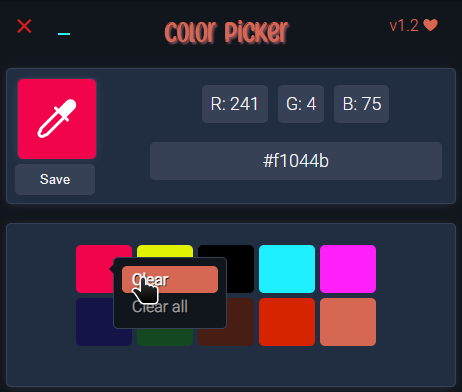

#  Color picker (stand-alone version)

It's standalone version of my color picker

Find navigator version [here ](https://github.com/DevilishDante/color-picker)

With my color picker, you can :

* Copy/paste color picked in hex and rgb
* Save some color, if you want (10 max)
* and choose color with the picker or pick a color
* Manage saved colors using history()

## Preview

## How to install

1. Unzip in a folder
2. Just click on "Color Picker" ! 😸
